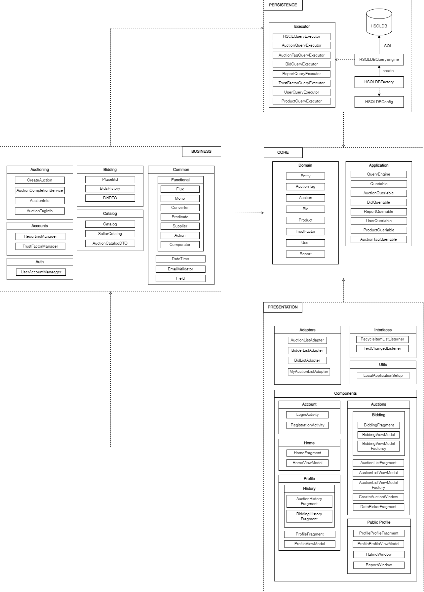

# The Auction House (Iteration 2)

## Architecture

### Core
This layer contains enterprise logics that are foundational to the application. It has no dependencies, and every other external layer depends on it. This honors the Dependency Inversion Principle (DIP) and ensures that the domain is loosely coupled to the external layers that are more subject to frequent changes.

`application`: interfaces to be realized by external layers, such as query engine, and to be dependency-injected in the business layer

`domain`: entities that capture the all important domain logics

### Presentation
This layer contains interactive pages for welcome, registration, login, profile, catalog, auctioning, bidding, and reporting. It gracefully handles exceptions and returns user-friendly results.

`account`: registration and login UI

`home`: welcome UI

`profile`: user info UI

`auction`: catalog and auctioning

`bidding`: bidding and bid history

### Business
This layer is vertially sliced into 4 major use cases, including catalog, auction, bidding, and account. Each slice contains its own services and DTOs to model a particular use case. This honors the single responsibility principle and promotes high cohesion within each use case boundary. Cross-boundary concerns are placed under common and exception.

`account`: registration and login

`catalog`: auctions listing for new users and sellers

`bidding`: bidding and bid history

`auction`: auctioning

`common`: cross-boundary concerns

`exception`: customized exception

### Persistence
This layer contains 2 versions of query engine to execute SQL-based CRUD operations against a relational database. One is the stub used in testing. The other is connected to HSQLDB database to be used in development and production. 

`queryEngines`: implementations of the `Queriable` interaface in `application` to be used in `Database` that interacts with the HSQLDB instance
