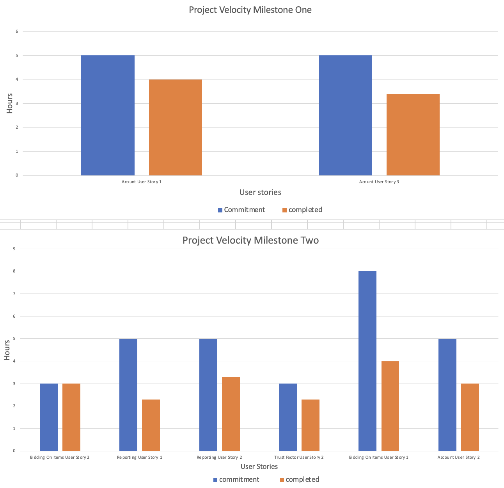

### Group 9 - The Auction House Retrospective

The part of our project that has not been as successful is project-wise refactoring. This includes architectural refactoring and business logic refactoring. During iteration 2, we refactored our n-tier architecture into a hexagonal architecture where the central core layer contains the abstractions that all other layers depend on. On top of that, we increased the granularity of the business layer by splitting it into several use case boundaries. While the architectural refactoring did contribute to looser coupling and higher cohesion of our modules, it led to some team members not being able to sync up with the latest changes and thus finding it hard to navigate through the codebase. This brought down our project velocity during iteration 2 quite a bit. Another issue is frequent refactoring of business logics among several team members who were touching the same piece of the codebase concurrently. The refactoring usually includes renaming and sometimes restructuring of variables, functions, classes, and packages. This led to merge conflicts that took a long time to resolve.

Another issue was managing technical debt as the codebase grows. Refactoring is one way to reduce technical debt and improve the code's quality, but it can also introduce new technical debt if not done properly. To mitigate this risk, it's important to discuss the priority of refactoring tasks based on their impact and urgency and to have a plan in place for handling any issues that arise, such as members no longer understanding the architecture. Regularly reviewing and addressing technical debt could have helped ensure the codebase remained maintainable.

A concrete way of improvement is to have team members do a more in-depth research of modules they work on and hold knowledge-sharing sessions as part of iteration planning. The purpose is to capture as many business details as we can to make sure we are on the right track when implementing the code and to help everyone sync up with each other on domain knowledge. This will help us avoid both large-scale refactoring of the modules and small-scale refactoring of the business logics.

To facilitate this, we can consider tools like draw.io or ProcessOn to create mind maps or flowcharts to illustrate the business processes in iteration planning. Throughout the iteration, we can hold Scrum-like meetings to let team members demo their progress to the whole team so that everybody has a clear understanding of the current state of the project and not get lost.

At the end of the iteration, we can measure the effectiveness of the improvement by comparing the overall project velocity with the previous iteration. We can reflect on whether each of the added app functionalities has sufficiently captured the end users’ intentions and how much refactoring of the existing code needed to be done. This helps us measure the adaptiveness of the current architecture to future changes. 

Below is a plot of the 2 data points of project velocity from the last two iterations.

